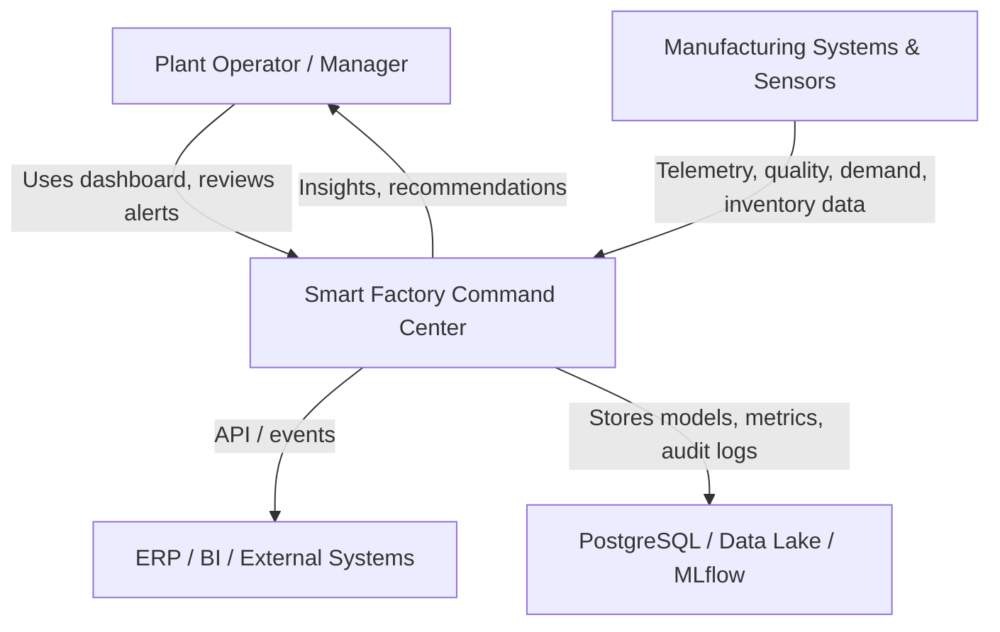
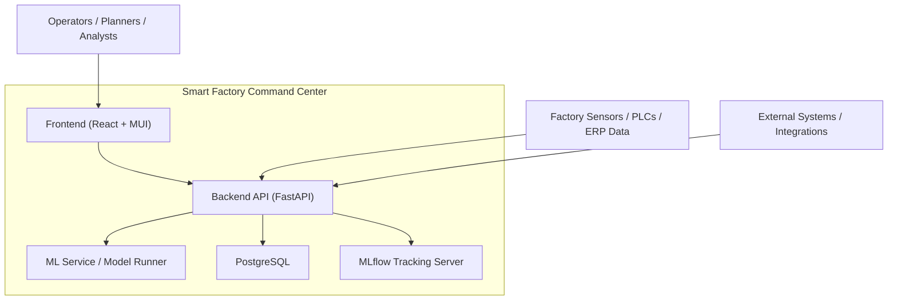
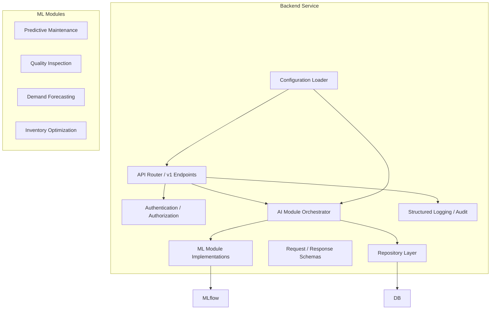
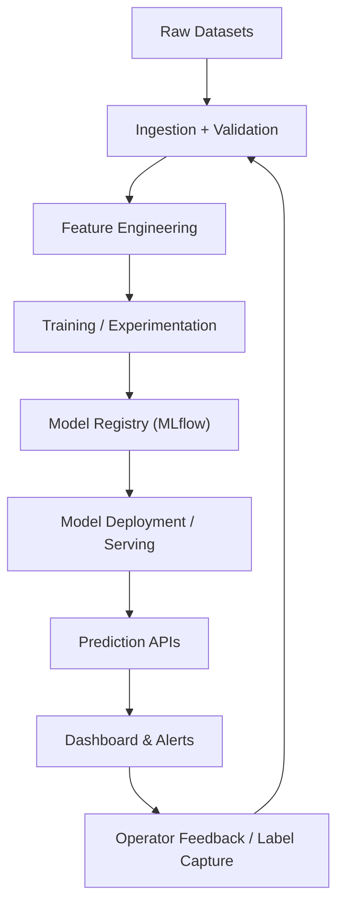
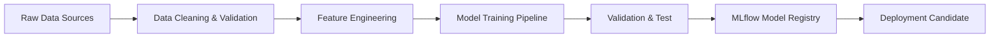
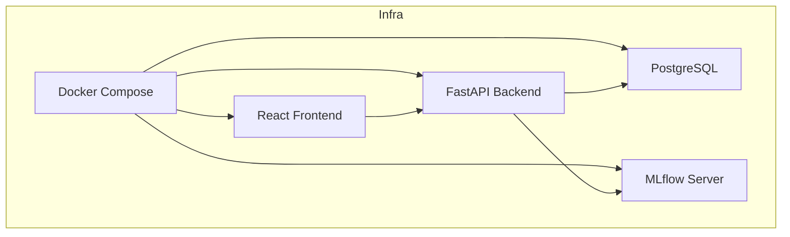
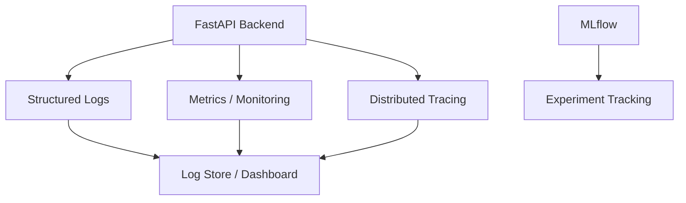
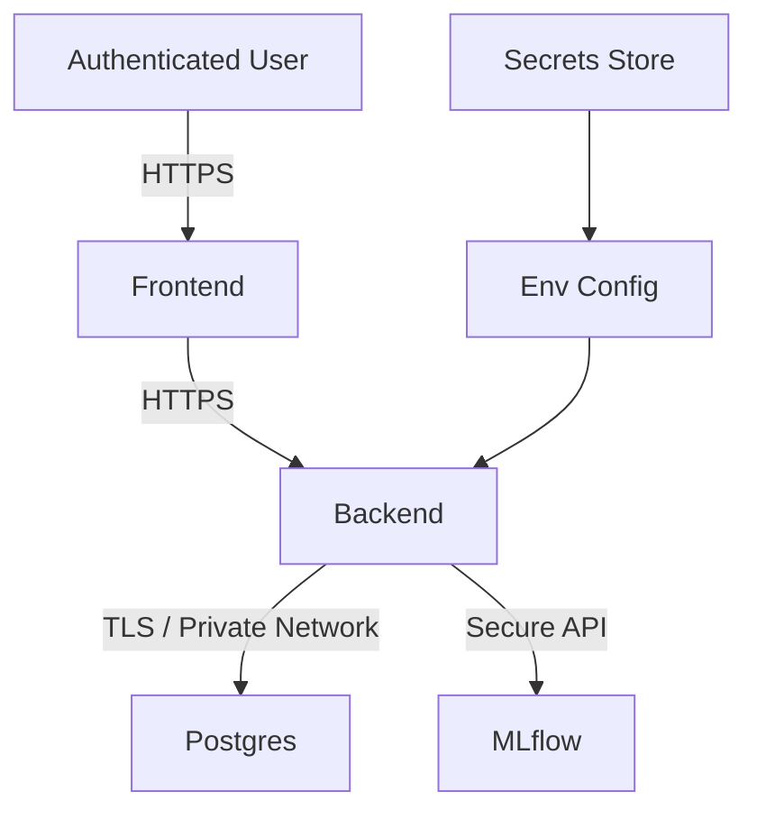

# Smart Factory Command Center Architecture

## Overview

The Smart Factory Command Center is an integrated AI operations platform for manufacturing. It delivers four core intelligence modules:

* Predictive Maintenance
* Quality Inspection
* Demand Forecasting
* Inventory Optimization

These modules are supported by a FastAPI backend, React dashboard, PostgreSQL persistence, MLflow tracking, and Docker-based deployment.

## Context Diagram

## Container Diagram

## Component Diagram

## Data Flow Diagram

## Training Architecture

* Training pipelines are built around dataset-specific modules:
  * `ai4i-2020-predictive-maintenance`
  * `steel-plates-faults`
  * `store-item-demand-forecasting`
  * `supply-chain-analytics`
* Feature engineering, validation, and model evaluation are separated from inference.
* MLflow tracks experiments, parameters, metrics, and artifacts.
* Models are versioned and promoted through:
  * development
  * staging
  * production
* Training jobs may run locally, in CI, or in a containerized batch environment.

### Training Architecture Diagram

## Deployment Architecture

* Deployment is container-first using Docker Compose.
* Core runtime containers:
  * `frontend` — React dashboard
  * `backend` — FastAPI service
  * `postgres` — PostgreSQL database
  * `mlflow` — MLflow tracking server
* Environment-specific config files are stored in `configs/env/` and injected at runtime.
* Production deployment can be extended to Kubernetes or cloud container services.

### Deployment Architecture Diagram

## Observability Architecture

* Logging
  * Structured logs emitted by `app/backend/src/core/logging.py`
  * Standardized log format with timestamp, level, module, correlation ID, and request metadata.
* Monitoring
  * Application metrics from API request latency, error rate, and model inference duration.
  * Optionally integrate Prometheus and Grafana for infrastructure-level metrics.
* Tracing
  * Correlation IDs flow from frontend requests through backend API calls and database operations.
* ML observability
  * MLflow records experiment metrics, model versions, and artifact lineage.

### Observability Diagram

## Security Architecture

* API access is protected using authentication tokens and role-based access control at the FastAPI layer.
* Secrets and credentials are managed via environment variables, not checked into source control.
* Network isolation ensures backend and database communication is limited to trusted service boundaries inside Docker Compose or the chosen deployment platform.
* Database access uses dedicated service accounts and least-privilege grants.
* Data privacy and governance are enforced by keeping training data and production inference data logically separated.
* Input validation and schema enforcement prevent malformed requests from reaching model and persistence layers.

### Security Architecture Diagram

* MAPE

API Endpoint:

POST /api/forecast-demand

Output:

{
"next_week_forecast": 15420,
"confidence": 0.91
}

---

### Inventory Optimization Module

Dataset:
Supply Chain Analytics

Input Features:

* Inventory Levels
* Lead Times
* Demand Forecast
* Supplier Performance

Feature Engineering:

* Days of Inventory
* Consumption Rate
* Supplier Risk Score

Algorithms:

Baseline:

* Linear Regression

Intermediate:

* Random Forest

Primary Production Model:

* XGBoost

Evaluation Metrics:

* MAE
* RMSE

API Endpoint:

POST /api/inventory-risk

Output:

{
"stockout_probability": 0.74,
"recommended_reorder": 500
}

---

## Database Design

Tables:

ManufacturingAssets
MaintenancePredictions
QualityPredictions
DemandForecasts
InventoryRecommendations
ModelMetadata
PredictionAudit

---

## Deployment Architecture

Docker Containers

1. Frontend

   * React

2. Backend

   * FastAPI

3. Database

   * PostgreSQL

4. ML Services

   * Scikit-Learn Models
   * TensorFlow Models

5. MLflow Server

6. Monitoring

Optional:

* Prometheus
* Grafana

---

## CI/CD Pipeline

GitHub

↓

GitHub Actions

↓

Unit Tests

↓

Model Validation

↓

Docker Build

↓

Container Registry

↓

Deployment

---

## Future Architecture

Phase 2:

* Kafka Event Streaming
* Real-Time Predictions
* IoT Sensor Integration

Phase 3:

* CNN-Based Visual Inspection
* OpenCV Integration
* Transfer Learning

Phase 4:

* Reinforcement Learning
* Production Scheduling Optimization

Phase 5:

* Multi-Factory Command Center
* Cross-Plant Analytics
* Digital Twin Integration
