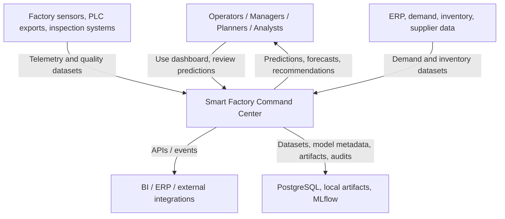
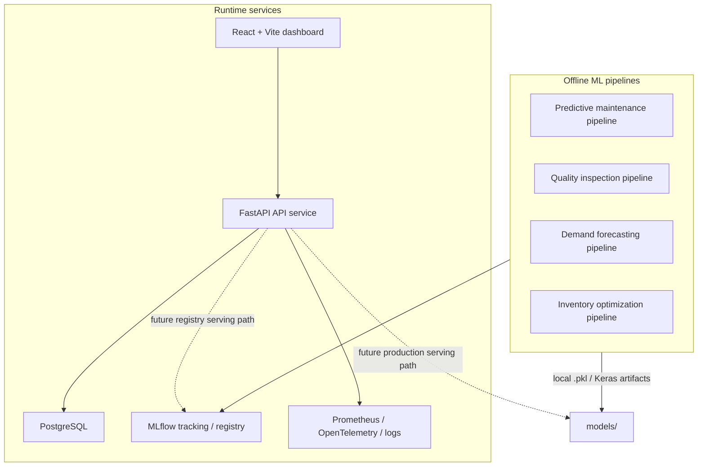
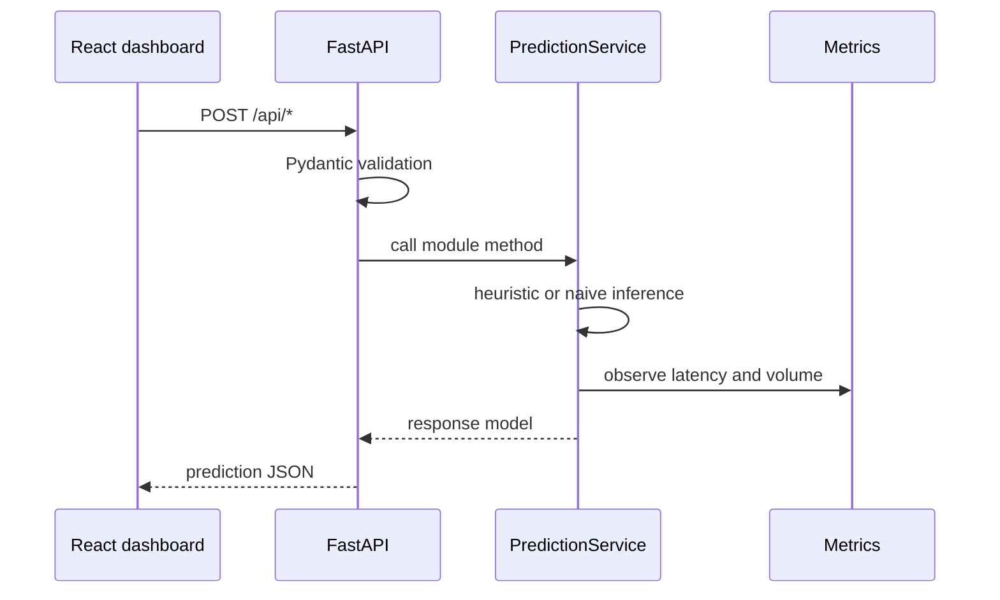
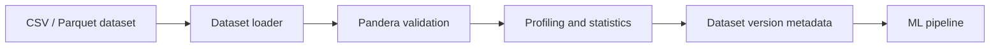
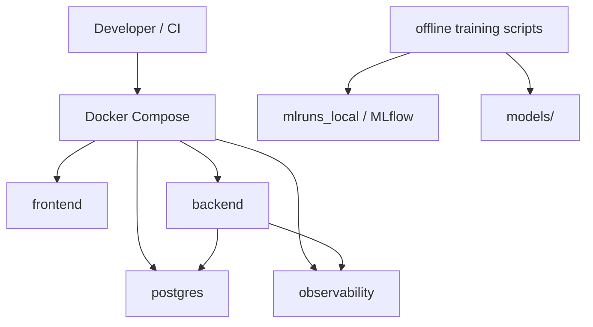
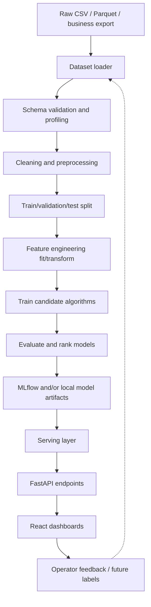

# Smart Factory Command Center Architecture

## 1. Overview

The Smart Factory Command Center is a modular AI operations platform for manufacturing analytics. It combines a React dashboard, FastAPI service layer, offline ML training pipelines, dataset validation utilities, model persistence, and observability support.

The platform is organized around four business modules:

| Module | Business goal | Current implementation status | Main ML task |
|---|---|---:|---|
| Predictive Maintenance | Predict equipment failure risk before downtime | Offline ML complete; API currently uses heuristic fallback | Binary classification |
| Quality Inspection | Detect and classify steel plate defects | Offline ML complete; API currently uses heuristic fallback | 7-class classification |
| Demand Forecasting | Forecast future store-item demand | Offline ML complete; API currently uses naive fallback | Regression / time-series forecasting |
| Inventory Optimization | Estimate stockout risk and reorder quantity | Implemented as top-level ML package plus persisted artifacts; API currently uses deterministic risk formula | Regression / replenishment recommendation |

Important implementation note: the repository contains real offline ML pipelines under `app/backend/src/app/ml/*` and `ml/inventory_optimization/*`, but the active lightweight API in `app/backend/api.py` delegates to `app/backend/services.py`, which currently serves deterministic fallback logic instead of loading the trained model artifacts.

## 2. System Context



## 3. Container Architecture



### Runtime Components

| Component | Location | Responsibility |
|---|---|---|
| Frontend | `frontend/src` | React dashboards for executive view, maintenance, quality, demand, and inventory |
| Lightweight API | `app/backend/api.py` | FastAPI endpoints used by the current frontend/API setup |
| API schemas | `app/backend/schemas.py` | Pydantic request/response models for prediction endpoints |
| API service | `app/backend/services.py` | Current heuristic/naive prediction service |
| Backend app skeleton | `app/backend/src/app` | More production-oriented FastAPI package structure with config, db, data, routes, and ML modules |
| Data layer | `app/backend/src/app/data` | Dataset loaders, validation, profiling, and versioning |
| Database layer | `app/backend/src/app/db` | Async SQLAlchemy engine/session setup |
| Observability | `app/backend/metrics.py`, `observability/*` | Prometheus metrics, OpenTelemetry collector, Logstash config |
| Inventory ML package | `ml/inventory_optimization` | Top-level inventory optimization training package and saved artifacts |

## 4. API Architecture

The active API exposes four prediction endpoints:

| Endpoint | Request schema | Response schema | Current service behavior |
|---|---|---|---|
| `POST /api/predict-maintenance` | `MaintenanceRequest` | `MaintenanceResponse` | Computes a risk score from average sensor readings using `tanh` |
| `POST /api/predict-quality` | `QualityRequest` | `QualityResponse` | Estimates pass rate from mean/std of submitted quality metrics |
| `POST /api/forecast-demand` | `DemandForecastRequest` | `DemandForecastResponse` | Repeats the last-7-day average for the requested horizon |
| `POST /api/inventory-risk` | `InventoryRiskRequest` | `InventoryRiskResponse` | Compares stock with summed horizon demand and recommends reorder |
| `GET /healthz` | none | status JSON | Health check |



## 5. Data and Dataset Architecture

The project documentation refers to public ML datasets often hosted or mirrored on Kaggle. There is no "Keras database" in the repo. Keras is used as a deep learning API for ANN and LSTM models; the datasets are loaded from CSV or Parquet by project loaders.

| Module | Canonical dataset | Typical source category | Loader | Target |
|---|---|---|---|---|
| Predictive Maintenance | AI4I 2020 Predictive Maintenance | Public manufacturing dataset / Kaggle-style CSV | `AI4IDatasetLoader`, `PredictiveMaintenanceLoader` | `machine_failure` |
| Quality Inspection | Steel Plates Faults | Public UCI/Kaggle-style tabular dataset | `SteelPlatesDatasetLoader`, `QualityInspectionLoader` | `class` |
| Demand Forecasting | Store Item Demand Forecasting | Kaggle-style store-item sales time-series dataset | `DemandForecastingDatasetLoader`, `DemandForecastingLoader` | `sales` / normalized `demand` |
| Inventory Optimization | Supply Chain Analytics | Supply chain CSV/Parquet or synthetic/business export | `SupplyChainDatasetLoader`, `InventoryLoader` | `reorder_quantity`, stockout/risk signal |

### Dataset Loading and Validation

The shared data layer supports:

1. CSV and Parquet loading.
2. Column normalization.
3. Pandera schema validation.
4. Dataset profiling.
5. Missing-value analysis.
6. Dataset version metadata.



## 6. ML Pipeline Pattern

The main offline modules follow the same architecture:

```text
loader.py          Load raw data and validate required columns
preprocessing.py   Clean data, validate numeric columns, split train/test
features.py        Fit/transform feature engineering
train.py           Build candidate algorithms
evaluate.py        Compute metrics and compare models
pipeline.py        Orchestrate end-to-end training/evaluation/persistence
model_store.py     Log to MLflow and/or persist artifacts locally
run.py             CLI entry point
```

Core design principle: split the data before fitting feature engineering objects, then call `fit` on training data and `transform` on validation/test data. This avoids leakage from test data into engineered feature statistics.

## 7. Module Architecture Details

### 7.1 Predictive Maintenance

| Area | Detail |
|---|---|
| Location | `app/backend/src/app/ml/predictive_maintenance` |
| Dataset | AI4I 2020 Predictive Maintenance |
| Problem type | Binary classification |
| Target | `machine_failure` |
| Raw features | `air_temperature`, `process_temperature`, `rotational_speed`, `torque`, `tool_wear` |
| Engineered features | `temp_delta`, `wear_rate`, `torque_ratio`, `temperature_ratio` |
| Split strategy | Stratified train/test split |
| Evaluation metrics | Accuracy, precision, recall, F1, ROC AUC |
| Model persistence | MLflow plus local model artifact support |

Algorithms used:

| Algorithm | Library | Purpose / notes |
|---|---|---|
| Logistic Regression | Scikit-Learn | Baseline linear classifier with `StandardScaler` |
| Random Forest Classifier | Scikit-Learn | Nonlinear ensemble classifier |
| XGBoost Classifier | XGBoost | Gradient boosted trees with `n_estimators=200`, `max_depth=6`, `learning_rate=0.1` |
| ANN | TensorFlow/Keras | Dense neural network: 64-ReLU -> dropout -> 32-ReLU -> dropout -> sigmoid |

Keras usage:

```text
Sequential(
  Dense(64, relu),
  Dropout(0.2),
  Dense(32, relu),
  Dropout(0.1),
  Dense(1, sigmoid)
)
loss = binary_crossentropy
optimizer = Adam(learning_rate=0.001)
early stopping = monitor val_loss, patience 5
```

### 7.2 Quality Inspection

| Area | Detail |
|---|---|
| Location | `app/backend/src/app/ml/quality_inspection` |
| Dataset | Steel Plates Faults |
| Problem type | Multi-class classification |
| Target | `class` with 7 fault classes |
| Raw features | `X_Minimum`, `X_Maximum`, `Y_Minimum`, `Y_Maximum`, `Pixel_area`, `Bare_Nuclei` |
| Engineered features | `x_range`, `y_range`, `area_ratio`, `nuclei_density`, `shape_ratio` |
| Split strategy | Stratified train/test split |
| Evaluation metrics | Accuracy, precision, recall, F1 |
| Model persistence | MLflow plus local model artifact support |

Algorithms used:

| Algorithm | Library | Purpose / notes |
|---|---|---|
| Decision Tree Classifier | Scikit-Learn | Interpretable baseline with depth/min-sample constraints |
| SVM | Scikit-Learn | RBF-kernel classifier with probability estimates |
| XGBoost Classifier | XGBoost | Multi-class gradient boosted trees, `num_class=7`, `mlogloss` |
| ANN | TensorFlow/Keras | Dense softmax classifier for seven classes |

Keras usage:

```text
Sequential(
  Dense(128, relu),
  Dropout(0.3),
  Dense(64, relu),
  Dropout(0.2),
  Dense(32, relu),
  Dropout(0.1),
  Dense(7, softmax)
)
loss = sparse_categorical_crossentropy
optimizer = Adam(learning_rate=0.001)
early stopping = monitor val_loss, patience 10
```

### 7.3 Demand Forecasting

| Area | Detail |
|---|---|
| Location | `app/backend/src/app/ml/demand_forecasting` |
| Dataset | Store Item Demand Forecasting |
| Problem type | Regression / time-series forecasting |
| Target | `sales` or transformed `demand` |
| Entity keys | `store`, `item`, `date` |
| Raw features | Date, store, item, sales/demand, promotion/calendar columns when available |
| Engineered features | Demand lags, rolling means/stds, day-of-week, month, quarter, day-of-year, weekend flag |
| Split strategy | Temporal split preserving order, commonly 70/15/15 |
| Evaluation metrics | RMSE, MAE, R2, MAPE-style percentage error where used |
| Model persistence | MLflow including `mlflow.keras` for LSTM and local artifacts |

Algorithms used:

| Algorithm | Library | Purpose / notes |
|---|---|---|
| Linear Regression | Scikit-Learn | Baseline regressor with `StandardScaler` |
| Random Forest Regressor | Scikit-Learn | Nonlinear tabular regressor |
| XGBoost Regressor | XGBoost | Gradient boosted tree regressor using squared-error objective |
| LSTM | TensorFlow/Keras | Sequence model trained from sliding windows |

Feature windows:

| Feature family | Values |
|---|---|
| Lag windows | 7, 14, 30 |
| Rolling windows | 7, 14, 30 |
| LSTM sliding window | Default lookback 30, lookahead 1 |

Keras LSTM usage:

```text
Sequential(
  LSTM(128, relu, return_sequences=True),
  Dropout(0.2),
  LSTM(64, relu),
  Dropout(0.2),
  Dense(32, relu),
  Dropout(0.1),
  Dense(1)
)
loss = mse
metrics = mae
optimizer = Adam(learning_rate=0.001)
early stopping = monitor val_loss, patience 10
```

### 7.4 Inventory Optimization

| Area | Detail |
|---|---|
| Location | `ml/inventory_optimization` |
| Dataset | Supply Chain Analytics |
| Problem type | Regression and replenishment recommendation |
| Target | `reorder_quantity` or demand/replenishment signal depending on training run |
| Entity keys | `warehouse`, `sku` or `warehouse_id`, `product_id`, `date` |
| Raw features | Stock/on-hand, demand, lead time, reorder point, supplier score, historical stockouts |
| Engineered features | Demand lags, rolling mean/std, day-of-week, month, weekend flag |
| Split strategy | Train/test split in pipeline |
| Evaluation metrics | RMSE, MAE, R2 |
| Model persistence | Local `.pkl` artifacts and MLflow registration helper |

Algorithms used:

| Algorithm | Library | Purpose / notes |
|---|---|---|
| Linear Regression | Scikit-Learn | Baseline stock/reorder regression |
| Random Forest Regressor | Scikit-Learn | Nonlinear inventory relationship model |
| XGBoost Regressor | XGBoost | Primary tree boosting candidate for structured inventory data |

Persisted artifacts currently present:

```text
models/inventory_optimization/Linear_Regression.pkl
models/inventory_optimization/Random_Forest.pkl
models/inventory_optimization/XGBoost.pkl
models/inventory_optimization/best_Random_Forest.pkl
```

## 8. Storage and Database Architecture

### PostgreSQL

The intended persistent store is PostgreSQL, accessed through SQLAlchemy async sessions in `app/backend/src/app/db/session.py`.

Planned logical tables from the architecture/design docs:

| Table | Purpose |
|---|---|
| `ManufacturingAssets` | Machine/asset metadata |
| `MaintenancePredictions` | Maintenance risk outputs and explanations |
| `QualityPredictions` | Batch/plate quality predictions |
| `DemandForecasts` | Store-item forecast outputs |
| `InventoryRecommendations` | Stockout risk and reorder recommendations |
| `ModelMetadata` | Model version, artifact, metric, and status metadata |
| `PredictionAudit` | Request/response audit trail and correlation IDs |

### MLflow and Local Artifacts

MLflow is the intended experiment and model registry layer:

1. Log hyperparameters, metrics, and artifacts.
2. Register candidate models.
3. Promote selected model versions through staging and production.
4. Preserve lineage between dataset version, training run, and model artifact.

When MLflow is not available, inventory optimization falls back to local `.pkl` files plus `.meta.json` summaries.

## 9. Observability Architecture

| Concern | Implementation |
|---|---|
| API metrics | `prometheus_fastapi_instrumentator` when importable |
| Model latency | `app/backend/metrics.py` histograms such as `model_latency_seconds` |
| Prediction volume | `prediction_volume_total` counter by model name |
| Tracing | Optional OpenTelemetry OTLP exporter to `localhost:4317` |
| Logs | Python structured logging helpers and Logstash config under `observability/` |
| ML experiment observability | MLflow runs, metrics, parameters, artifacts |

## 10. Deployment Architecture

The repo is container-oriented:

| Container / service | Source | Role |
|---|---|---|
| Frontend | `frontend` | React/Vite dashboard |
| Backend | `app/backend` | FastAPI API |
| PostgreSQL | `docker-compose.yml` | Persistence |
| Observability stack | `observability/docker-compose.yml` | Prometheus/OpenTelemetry/Logstash style support |
| MLflow | Design target | Experiment tracking and registry; local `mlruns_local` exists |



## 11. Security Architecture

The intended security model includes:

1. FastAPI request validation through Pydantic schemas.
2. Environment-driven configuration and secrets.
3. Role-based access control at the API layer.
4. Least-privilege database credentials.
5. Network isolation between frontend, backend, database, MLflow, and observability services.
6. Separate treatment of training datasets, inference payloads, and audit logs.

Current implementation note: the lightweight API enables permissive CORS with `allow_origins=["*"]`, which is convenient for local development but should be restricted for production.

## 12. End-to-End Data Flow



## 13. Current Gaps and Next Architecture Steps

| Gap | Impact | Recommended next step |
|---|---|---|
| API does not yet load trained PM/QI/DF/IO models | Dashboard predictions do not reflect offline model training | Add model loader/registry adapter in `PredictionService` |
| Two backend structures exist (`app/backend/api.py` and `app/backend/src/app`) | Confusing service boundary | Consolidate on the package app or document which is canonical |
| Database models/migrations are not defined for planned tables | PostgreSQL persistence is architectural, not fully implemented | Add SQLAlchemy models and Alembic migrations |
| Dataset sources are documented but not vendored | Reproducibility depends on external CSVs | Add `data/README.md` with download links, checksums, expected filenames |
| Keras artifacts are trained offline but not served | Neural models are not part of runtime inference yet | Add TensorFlow/Keras loading path and input adapters |
| Authentication is documented but not active in lightweight API | Local-only security posture | Add API key/JWT middleware before production |

## 14. Technology Stack

| Layer | Technology |
|---|---|
| Frontend | React, Vite |
| Backend API | FastAPI, Pydantic |
| Database | PostgreSQL, SQLAlchemy async |
| Validation | Pandera |
| Classical ML | Scikit-Learn |
| Gradient boosting | XGBoost |
| Deep learning | TensorFlow/Keras |
| Experiment tracking | MLflow |
| Metrics/tracing | Prometheus instrumentation, OpenTelemetry |
| Packaging/deployment | Docker Compose |
