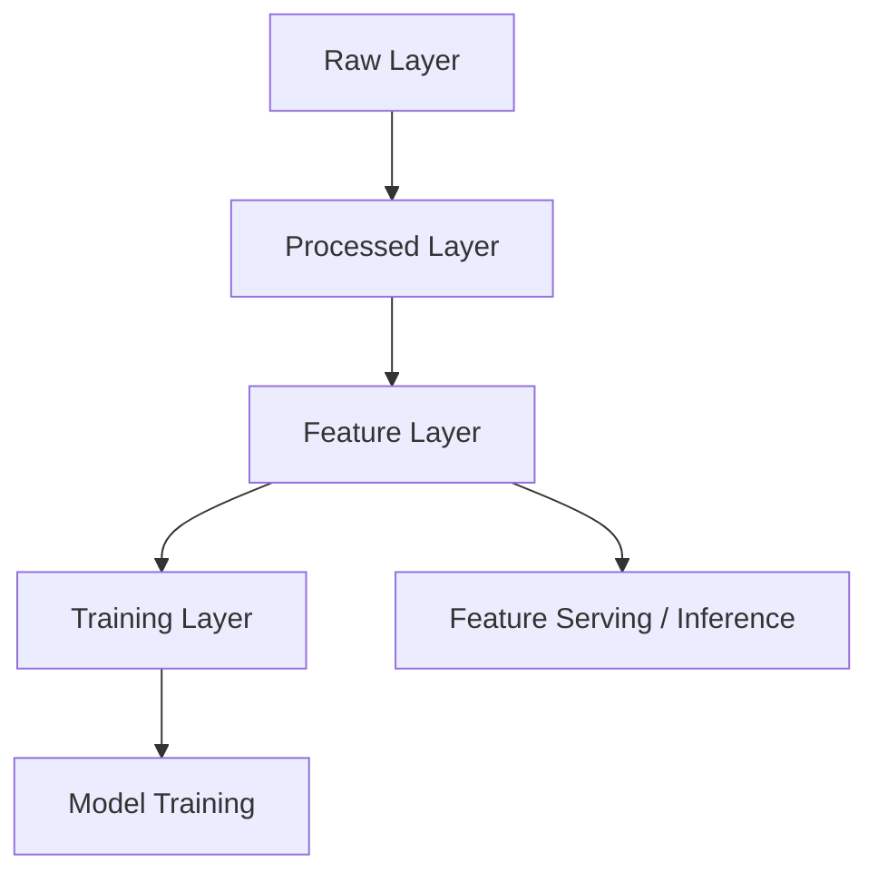

# Feature Store Design

## Overview

This document defines the feature store architecture for the Smart Factory Command Center. It covers feature namespaces, storage layers, serving patterns, and lifecycle management for each AI module.

## Goals

* Enable reusable features across training and inference.
* Support consistent feature computation for production predictions.
* Maintain feature lineage and versioning.
* Separate raw ingestion from processed and feature-serving layers.

## Layer Definitions

### Raw Layer

* Stores source dataset records exactly as ingested.
* Immutable, append-only by ingestion batch.
* Used for traceability and replay.
* Example storage: CSV / Parquet in data lake, raw batch tables.

### Processed Layer

* Stores cleansed, normalized, and joined data.
* Contains derived fields, standardized types, and master keys.
* Provides a canonical dataset for training pipelines.
* Example storage: Parquet tables, staging database schema.

### Feature Layer

* Stores feature vectors and feature metadata keyed by entity and timestamp.
* Includes engineered features ready for model consumption.
* Supports feature versioning and expiration policy.
* Example storage: feature store tables, parquet materialized views.

### Training Layer

* Stores training-ready datasets labeled for supervised learning.
* Contains train / validation / test splits, label metadata, and experiment references.
* Sets the ground truth for model training and evaluation.
* Example storage: dataset artifacts in MLflow / Parquet snapshots.

## Feature Store Architecture

## Feature Store Namespace

Each AI module has a dedicated namespace and feature table:

* `predictive_maintenance_features`
* `quality_inspection_features`
* `demand_forecasting_features`
* `inventory_optimization_features`

### Naming Conventions

* `namespace_entity_feature` for feature group names.
* `entity_id` for primary feature keys.
* `event_timestamp` or `date` for temporal features.
* `feature_version` to track transformation logic updates.

## Feature Table Design

### Predictive Maintenance Feature Table

| Column | Type | Description |
|---|---|---|
| `machine_id` | string | Machine entity key |
| `event_timestamp` | datetime | Sensor reading timestamp |
| `air_temperature` | numeric | Raw temperature measurement |
| `process_temperature` | numeric | Raw process temperature |
| `rotational_speed` | numeric | Raw speed measurement |
| `torque` | numeric | Raw torque measurement |
| `tool_wear` | numeric | Raw wear percentage |
| `health_score` | numeric | Derived machine health feature |
| `temp_delta` | numeric | Derived temperature delta feature |
| `wear_rate` | numeric | Derived wear rate feature |
| `failure_risk_score` | numeric | Model-ready risk score feature |
| `feature_version` | string | Feature generation version |
| `ingest_date` | datetime | Processed timestamp |

### Quality Inspection Feature Table

| Column | Type | Description |
|---|---|---|
| `plate_id` | string | Plate entity key |
| `inspection_date` | datetime | Inspection timestamp |
| `x_minimum` | numeric | Surface measurement |
| `x_maximum` | numeric | Surface measurement |
| `y_minimum` | numeric | Surface measurement |
| `y_maximum` | numeric | Surface measurement |
| `pixel_area` | numeric | Surface pixel area |
| `bare_nuclei` | numeric | Defect measurement |
| `surface_variation` | numeric | Engineered variance feature |
| `defect_signal` | numeric | Aggregated quality signal |
| `feature_version` | string | Feature generation version |
| `ingest_date` | datetime | Processed timestamp |

### Demand Forecasting Feature Table

| Column | Type | Description |
|---|---|---|
| `store_id` | integer | Store key |
| `item_id` | integer | Item key |
| `date` | date | Demand observation date |
| `lag_1_sales` | numeric | Sales lag-1 feature |
| `lag_7_sales` | numeric | Weekly lag feature |
| `rolling_mean_7` | numeric | 7-day rolling mean |
| `rolling_std_7` | numeric | 7-day rolling std dev |
| `promotion_flag` | boolean | Promotion indicator |
| `day_of_week` | integer | Temporal encoding |
| `month` | integer | Seasonal encoding |
| `event_calendar` | string | Event label feature |
| `feature_version` | string | Feature generation version |
| `ingest_date` | datetime | Processed timestamp |

### Inventory Optimization Feature Table

| Column | Type | Description |
|---|---|---|
| `product_id` | string | Product key |
| `warehouse_id` | string | Warehouse key |
| `date` | date | Inventory snapshot date |
| `on_hand` | numeric | Current inventory quantity |
| `reorder_point` | numeric | Policy threshold |
| `lead_time_days` | numeric | Supplier lead time |
| `forecast_demand` | numeric | Demand forecast input |
| `safety_stock` | numeric | Computed safety stock |
| `service_level` | numeric | Service level target |
| `stockout_risk` | numeric | Estimated stockout probability |
| `feature_version` | string | Feature generation version |
| `ingest_date` | datetime | Processed timestamp |

## Feature Generation Strategy

* Raw attributes are transformed into derived features in the processed layer.
* Feature definitions are centralized and versioned in code.
* Each feature table stores the same feature version for every row in a batch to ensure lineage.
* Feature freshness is enforced using `ingest_date` and `event_timestamp`.

## Feature Serving

* For inference, the backend queries the feature layer using the entity key and the latest valid timestamp.
* Online serving uses feature materialization for low-latency predictions.
* Batch training uses feature snapshots from the training layer.

## Training Dataset Construction

* Training datasets are built from the feature layer joined with the target label.
* A training metadata table records split definitions and dataset versions.
* Datasets are stored as Parquet artifacts and linked to MLflow experiment runs.

## Lineage and Metadata

Each feature record includes metadata fields:

* `feature_version`
* `ingest_date`
* `source_dataset`
* `processing_status`

This supports reproducibility and auditability.
